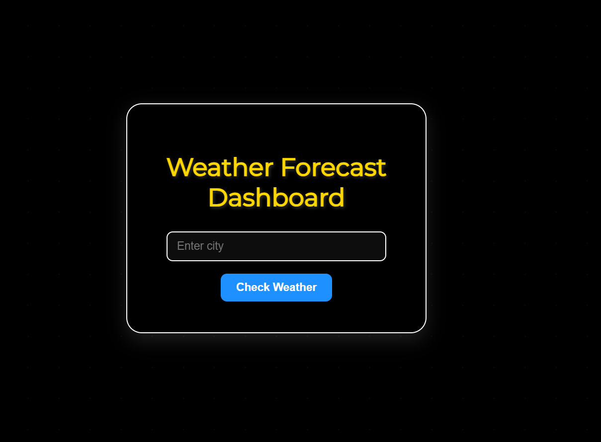
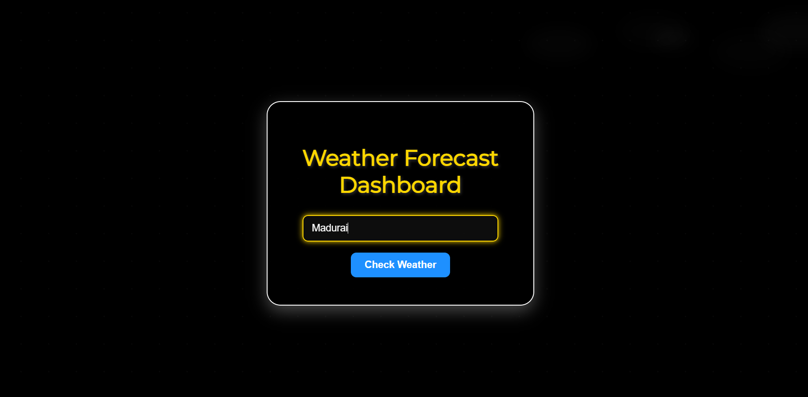
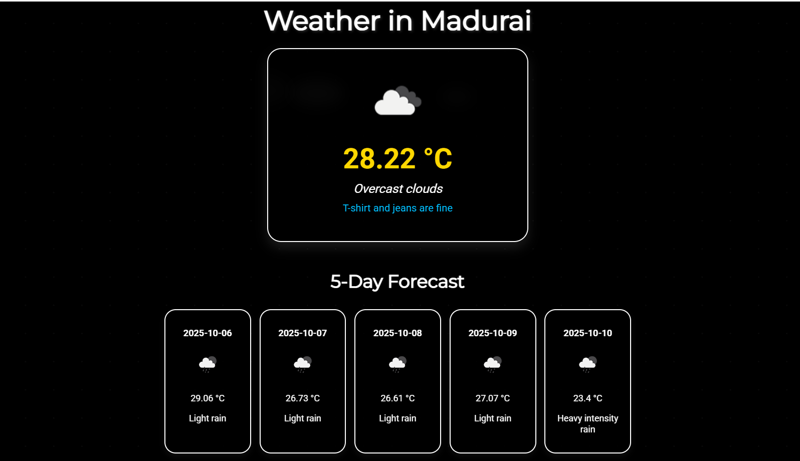
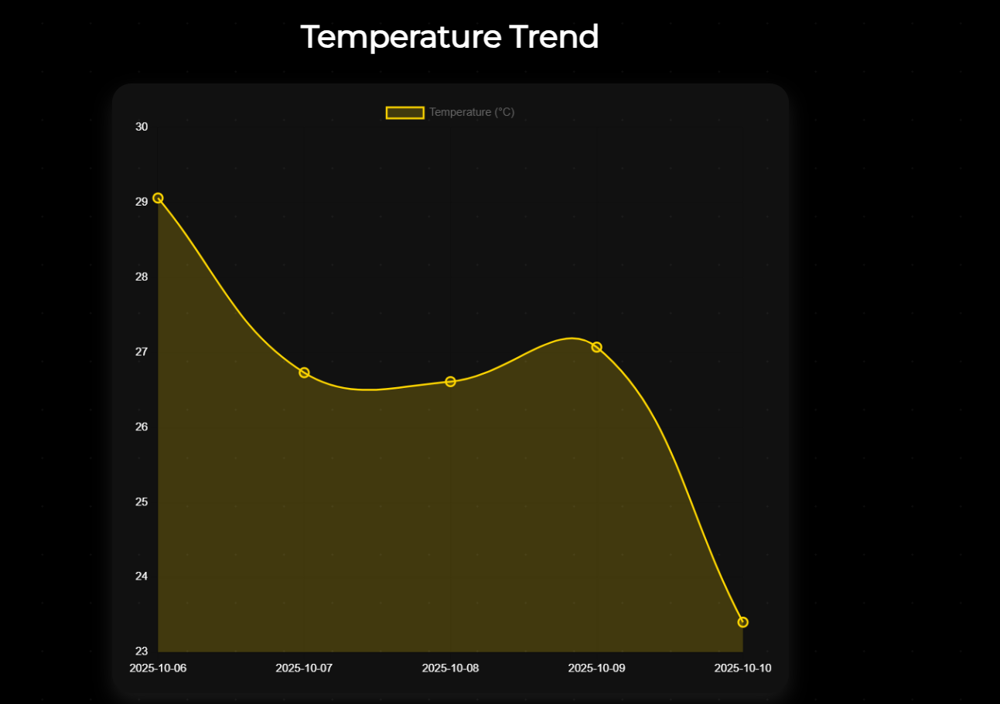

# 🌦️ Weather Dashboard (Django) 
    A simple and interactive **Weather Forecast Dashboard** built using Django and OpenWeatherMap API.  
    This project allows users to check the current weather of any city and displays results in a clean, user-friendly interface.

## Project Overview
    The Weather Dashboard enables users to:  
        - Enter the name of any city worldwide  
        - Fetch real-time weather data: temperature, humidity, and description  
        - Display results dynamically in a user-friendly dashboard  
    This project demonstrates **API integration, Django development, and frontend display** of dynamic data.

⚡ Features
        - Search for any city and get real-time weather updates  
        - Display temperature, humidity, and weather description  
        - 5-day weather forecast
        - Clothing suggestions based on temperature
        - Clean and responsive UI  
        - Screenshots saved in `results/` folder for quick visualization  

## Screenshots
### Example Output 
   
   
### Example Weather Output
   
### Dashboard Example
   

## Installation & Setup

### Prerequisites
    - Python 3.x  
    - Django  
    - Requests library  

**Clone Repository**
    git clone https://github.com/Mohanapriya1022/weather-dashboard.git

1.Create & Activate Virtual Environment
    python -m venv venv
    venv\Scripts\activate

2.Install Dependencies

    pip install -r requirements.txt

3.Configure Environment Variables

4.Create a .env file in the project root:

    DJANGO_SECRET_KEY=your_secret_key
    DEBUG=True
    OPENWEATHER_API_KEY=your_openweather_api_key

5.Run the Server

    python manage.py migrate
    python manage.py runserver
    
    Open http://127.0.0.1:8000/ in your browser.

## How to Use
    a.Enter a city name in the input field
    b.Click Check Weather
    c.The dashboard displays current weather details for the entered city

## Technologies Used
    Backend: Django
    API: OpenWeatherMap
    Frontend: HTML, CSS
    Data Handling: Requests library

## Future Enhancements
    -Allow users to save favorite cities
    -Make the dashboard fully mobile-responsive

## License
    -This project is open-source and free to use.
All dependencies installable via pip install -r requirements.txt

Created and maintained by Mohana Priya S
